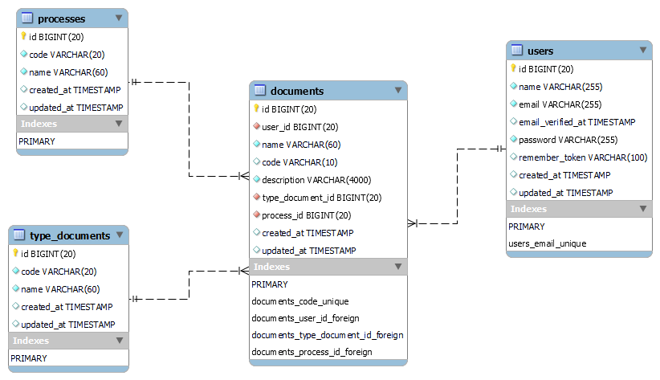

<!-- 

 -->

# Diagrama Entidad Relación

# 1.¿Cuáles son los requisitos del servidor para activar el script?
## Respuesta: Para instalar el Script los requisitos mínimos del servidor son:

- [Php version 8.2+]
- [MySQL 10.4+-MariaDB]
- [mod_rewrite Apache]
- [BCMath PHP Extension]
- [Ctype PHP Extension].
- [Mbstring PHP Extension]
- [PDO PHP Extension]
- [Tokenizer PHP Extension]
- [Session PHP Extension]

En la mayoría de los servidores, estas extensiones están activadas por defecto, pero debe consultar a su proveedor de alojamiento.
# 2.¿Cómo instalar el script?
## Respuesta: Para instalar el script siga los siguientes pasos.

- Extraiga el archivo .zip descargado en su PC o el código directamente desde GitHub.
- Cargue el archivo .zip en el directorio public_html de su servidor o en cualquier otro directorio en el que desee ejecutar.
- Extraiga el archivo zip en ese directorio.
- Cree una nueva base de datos a partir de la base de datos MySQL de su servidor.
- Cree un usuario DB para la base de datos y vincule esa base de datos al usuario DB.
- Configure las variables de entorno a partir del archivo .env-example.
- Escribe por la consola el comando `php artisan migrate fresh --seed`.
- Escribe el comando en una nueva consola `composer install`.
- Escribe el comando en una nueva consola `npm install`.
- Escribe el comando en una nueva consola `npm run dev`.
- Pulse en la URL amigable generada por el comando `php artisan serve`.
